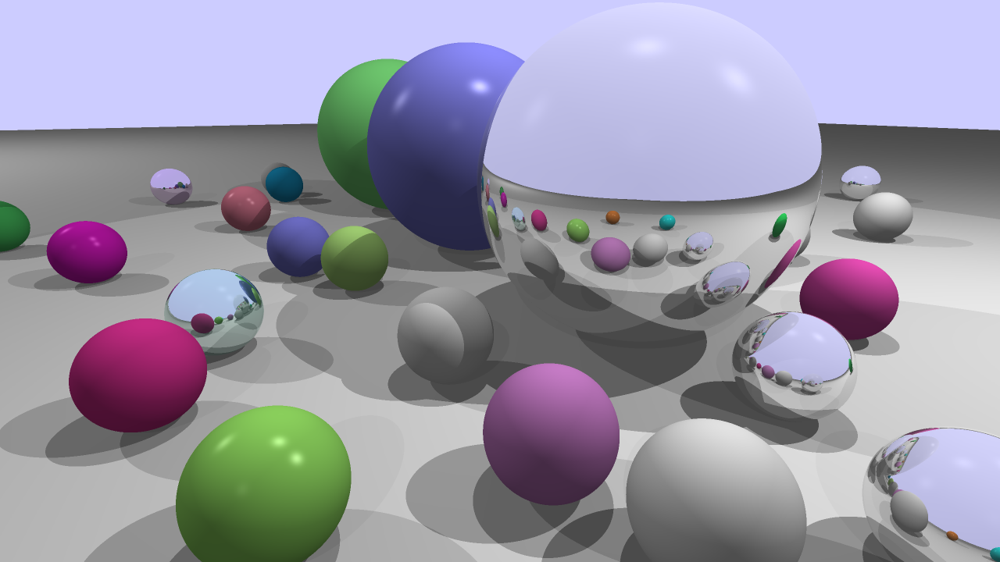
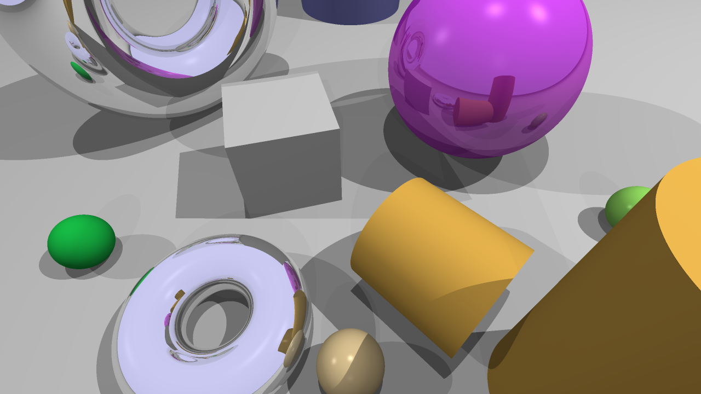

# Primitive Ray Tracer

- Ray traced lighting, shadows, reflections
- Spotlight, Directional Light and ,
- Ray-object intersections for planes, cubes, cylinders, spheres, and tori
- Constructive solid geometry operations (some issues)
- Supersampling

## Notes

- On linux with gcc 12 `abs` returns integers. I switched most uses of `abs` to `fabs`
- `ParseSceneBlock` is modified to take an additional parameter for supersampling. If the keyword supersampling is present in the sceneblock, supersampling is used. Otherwise it is not
